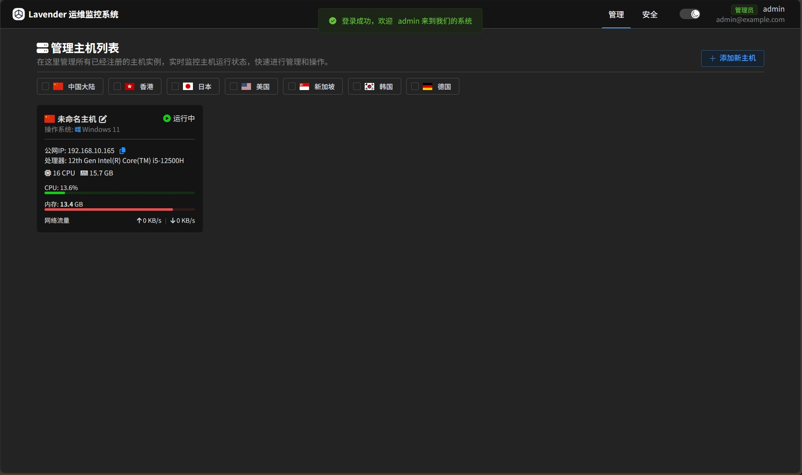
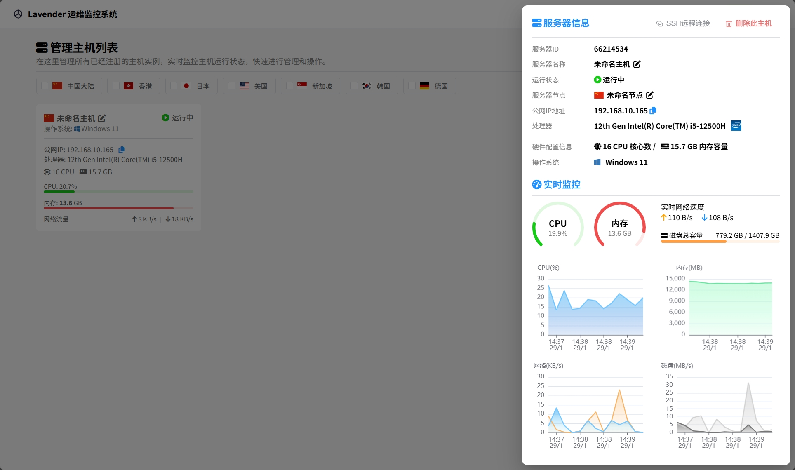
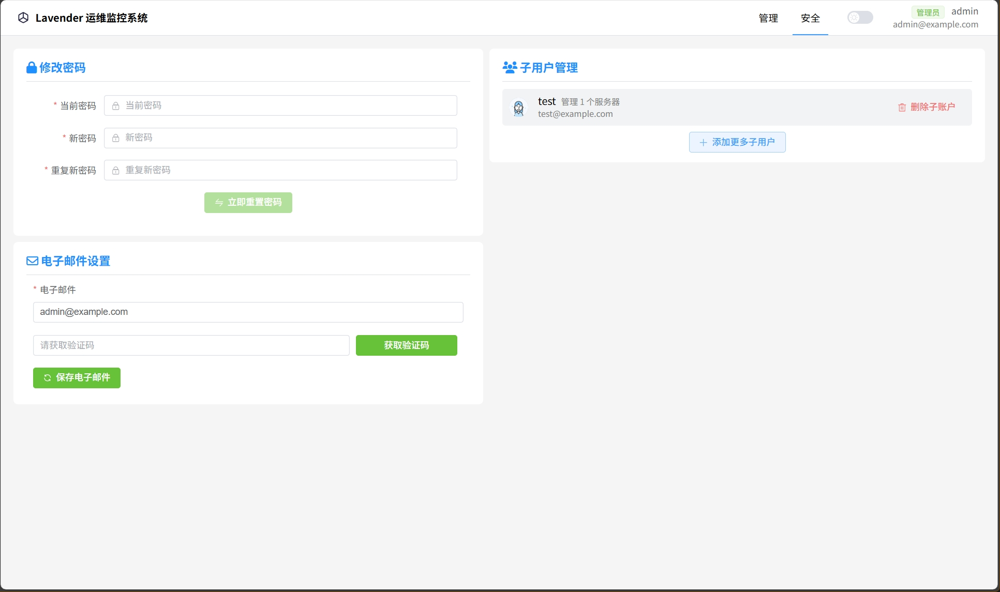
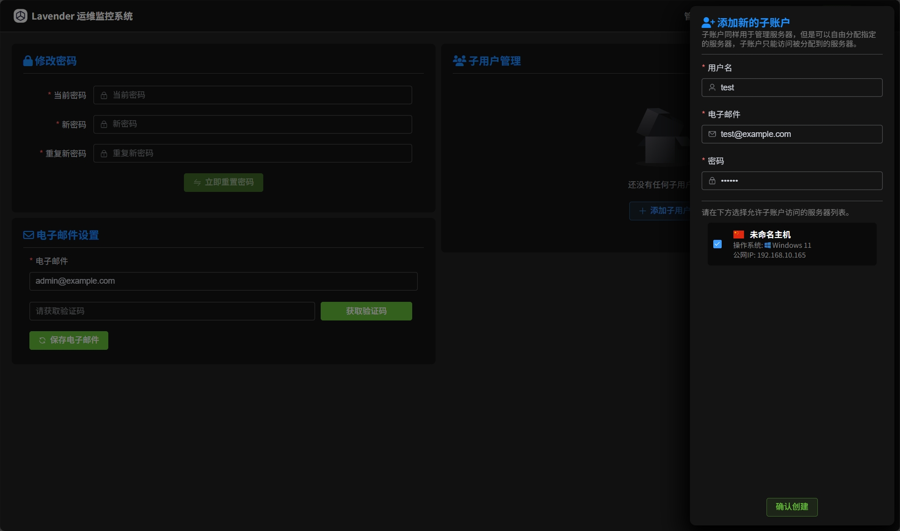
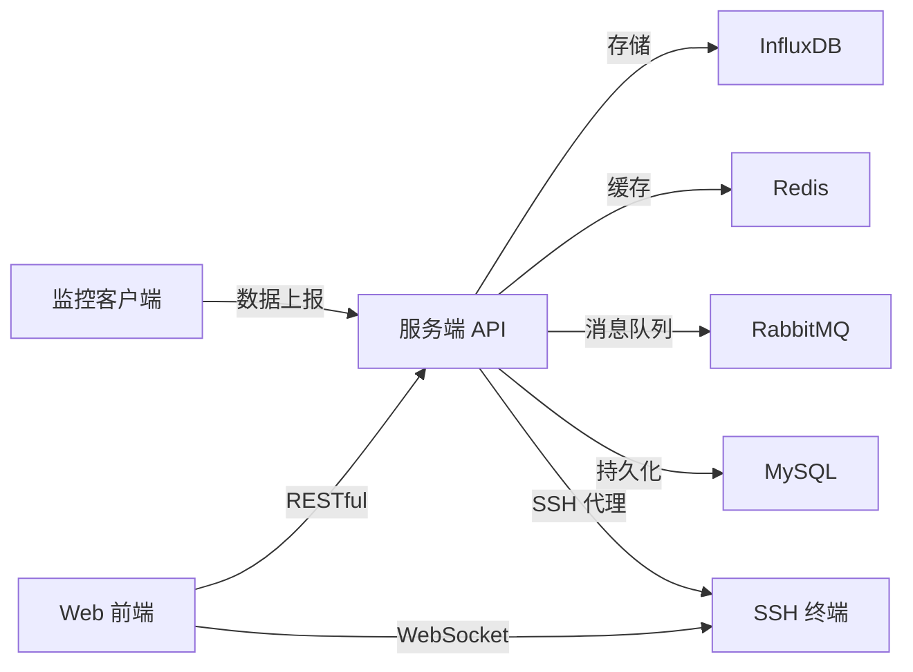

# Lavender Monitor

<div align="center">

**🚀 轻量级分布式服务器监控系统**

[](https://spring.io/projects/spring-boot)
[](https://vuejs.org/)
[](https://www.oracle.com/java/)

*基于 Spring Boot + Vue 3 的服务器实时监控与运维管理平台*

[特性介绍](#-核心特性) • [快速开始](#-快速开始) • [架构设计](#-系统架构) • [技术栈](#-技术栈) • [部署指南](#-部署指南)

</div>

---

## 📖 项目概述

**Lavender Monitor** 是一款轻量级服务器监控系统，采用前后端分离架构，基于 Spring Boot 3.x 和 Vue 3.x 技术栈构建。系统分为客户端、服务端和 Web 前端三部分，客户端部署在被监控服务器上采集数据，服务端负责数据处理和存储，前端提供可视化监控界面和远程管理功能。

### 📸 系统截图

#### 首页概览

<div align="center">
  
</div>

#### 数据监控

<div align="center">
  
</div>

#### 用户安全

<div align="center">
  
</div>

#### 添加子用户

<div align="center">
  
</div>

### 🎯 设计特点

- **🔄 分布式架构**：客户端-服务端架构，支持多台服务器同时监控
- **⚡ 实时监控**：基于时序数据库 InfluxDB，实现秒级数据采集与展示
- **🛡️ 安全认证**：JWT 认证 + Spring Security，保障系统安全
- **🎨 数据可视化**：ECharts 实时图表，直观展示服务器运行状态
- **💻 远程管理**：Web SSH 终端，方便远程操作服务器

### 🏗️ 系统组成



| 模块 | 职责 | 核心技术 |
|------|------|----------|
| **监控客户端** | 系统指标采集与上报 | Spring Boot 3.2 + OSHI + Quartz |
| **服务端** | 数据处理、API 服务、认证授权 | Spring Boot 3.1 + MyBatis Plus + JWT |
| **Web 前端** | 可视化展示、SSH 终端 | Vue 3 + Element Plus + Xterm.js |

## ✨ 核心特性

### 📊 智能监控引擎

- **🖥️ 多维度指标采集**
  - CPU 使用率、负载、温度监控
  - 内存使用、缓存、交换分区分析
  - 磁盘 I/O、空间占用、读写速率
  - 网络流量、连接数、带宽利用率
  - 进程级监控、端口监听状态

- **📈 时序数据分析**
  - 基于 InfluxDB 的高性能时序存储
  - 支持秒级、分钟级、小时级数据聚合
  - 历史数据趋势分析与异常检测
  - ECharts 实时动态图表渲染

### 🔐 安全与权限

- **身份认证体系**
  - JWT Token 无状态认证机制
  - Spring Security 多层安全防护
  - 基于角色的访问控制（RBAC）
  - 主账号与子账号分权管理

- **安全加固**
  - IP 地址限流与防刷机制
  - 接口请求频率控制
  - 敏感操作二次验证
  - 审计日志全链路追踪

### 💻 智能运维工具

- **Web SSH 终端**
  - 基于 WebSocket + JSCH 的实时终端
  - Xterm.js 完美终端模拟体验
  - 多标签页管理，支持并发连接
  - 命令历史记录与会话保持

- **消息通知系统**
  - RabbitMQ 异步消息处理
  - 邮件告警与验证码发送
  - 可扩展的告警通道（邮件/短信/webhook）

### 🌐 分布式管理

- **多租户架构**
  - 支持数百台服务器并发监控
  - 节点分组与标签管理
  - 跨地域、跨机房统一监控
  - 灵活的权限分配策略

## 🛠️ 技术栈

### 🔧 后端技术栈

#### 服务端核心框架 (lavender-monitor-server)

| 技术 | 版本 | 用途 |
|------|------|------|
| Spring Boot | 3.1.2 | 核心框架，提供依赖注入、自动配置 |
| Spring Security | 6.x | 安全框架，实现认证授权 |
| MyBatis Plus | 3.5.3+ | ORM 框架，简化数据库操作 |
| JWT | 4.3.0 | 无状态认证令牌生成与校验 |
| WebSocket | - | 实时双向通信协议 |
| JSCH | 0.1.55 | SSH 协议实现，支持远程连接 |
| Lombok | - | 代码简化，减少样板代码 |
| FastJSON2 | 2.0.25 | 高性能 JSON 序列化框架 |

#### 数据存储与缓存

| 技术 | 版本 | 用途 |
|------|------|------|
| MySQL | 8.0+ | 关系型数据库，存储用户、节点等核心数据 |
| InfluxDB | 2.0+ | 时序数据库，存储监控指标数据 |
| Redis | 5.0+ | 缓存中间件，限流、会话管理 |
| RabbitMQ | 3.8+ | 消息队列，处理异步任务 |

#### 客户端采集引擎 (lavender-monitor-client)

| 技术 | 版本 | 用途 |
|------|------|------|
| Spring Boot | 3.2.0 | 轻量级运行容器 |
| Quartz | - | 定时任务调度框架 |
| OSHI | 6.4.0 | 跨平台系统信息采集库 |
| FastJSON2 | 2.0.37 | JSON 数据序列化 |

### 🎨 前端技术栈 (lavender-monitor-web)

| 技术 | 版本 | 用途 |
|------|------|------|
| Vue 3 | 3.3.4 | 渐进式前端框架 |
| Element Plus | 2.3.9+ | 企业级 UI 组件库 |
| ECharts | 5.4.3 | 数据可视化图表库 |
| Xterm.js | 5.3.0 | Web 终端模拟器 |
| Pinia | 2.1.7 | 新一代状态管理工具 |
| Vue Router | 4.2.4 | 官方路由管理器 |
| Axios | 1.4.0 | HTTP 客户端 |
| Vite | 4.4.6 | 新一代前端构建工具 |
| VueUse | 10.3.0 | Vue 组合式工具集 |

## 🏗️ 系统架构

### 整体架构图

```
┌─────────────────────────────────────────────────────────────────┐
│                         Web 前端层                               │
│  ┌──────────────┐  ┌──────────────┐  ┌──────────────┐         │
│  │  监控大屏    │  │  SSH 终端    │  │  系统管理    │         │
│  └──────────────┘  └──────────────┘  └──────────────┘         │
└─────────────────────────────────────────────────────────────────┘
                            ↕ RESTful API / WebSocket
┌─────────────────────────────────────────────────────────────────┐
│                         服务端层                                 │
│  ┌──────────────┐  ┌──────────────┐  ┌──────────────┐         │
│  │ 认证授权模块  │  │ 监控数据模块  │  │ 运维管理模块 │         │
│  └──────────────┘  └──────────────┘  └──────────────┘         │
│  ┌──────────────┐  ┌──────────────┐  ┌──────────────┐         │
│  │  过滤器链    │  │  业务服务层   │  │  数据访问层  │         │
│  └──────────────┘  └──────────────┘  └──────────────┘         │
└─────────────────────────────────────────────────────────────────┘
                            ↕ 数据交互
┌─────────────────────────────────────────────────────────────────┐
│                         数据层                                   │
│  ┌──────────┐  ┌──────────┐  ┌──────────┐  ┌──────────┐       │
│  │  MySQL   │  │ InfluxDB │  │  Redis   │  │ RabbitMQ │       │
│  └──────────┘  └──────────┘  └──────────┘  └──────────┘       │
└─────────────────────────────────────────────────────────────────┘
                            ↑ 数据上报
┌─────────────────────────────────────────────────────────────────┐
│                         客户端层                                 │
│  ┌────────────────────┐      ┌────────────────────┐            │
│  │  服务器 A (Linux)   │      │  服务器 B (Windows) │  ...      │
│  │  监控客户端         │      │  监控客户端         │            │
│  └────────────────────┘      └────────────────────┘            │
└─────────────────────────────────────────────────────────────────┘
```

## 📦 项目结构

```
lavender-monitor/
├── lavender-monitor-client/    # 监控客户端
│   └── src/main/java/com/lavender/
│       ├── configuration/      # 配置类
│       ├── entity/            # 实体类
│       ├── task/              # 定时任务
│       └── utils/             # 工具类
├── lavender-monitor-server/    # 服务端
│   └── src/main/
│       ├── java/com/lavender/
│       │   ├── configuration/ # 配置类
│       │   ├── controller/    # 控制器
│       │   ├── entity/        # 实体类
│       │   ├── filter/        # 过滤器
│       │   ├── mapper/        # 数据访问层
│       │   ├── service/       # 业务逻辑层
│       │   ├── utils/         # 工具类
│       │   └── websocket/     # WebSocket
│       └── resources/         # 配置文件
├── lavender-monitor-web/       # Web 前端
│   └── src/
│       ├── component/         # 组件
│       ├── router/            # 路由
│       ├── store/             # 状态管理
│       └── views/             # 页面视图
└── sql/                       # 数据库脚本
```

## 🚀 快速开始

### 📋 环境要求

- JDK 17+
- Node.js 16+
- MySQL 8.0+
- Redis 5.0+
- RabbitMQ 3.8+
- InfluxDB 2.0+
- Maven 3.6+

### 🗄️ 数据库初始化

#### 1. MySQL 数据库配置

```sql
-- 创建数据库
CREATE DATABASE lavender_monitor 
  CHARACTER SET utf8mb4 
  COLLATE utf8mb4_unicode_ci;

-- 使用数据库
USE lavender_monitor;

-- 导入表结构
SOURCE sql/monitor.sql;
```

或使用命令行导入：

```bash
mysql -u root -p lavender_monitor < sql/monitor.sql
```

#### 2. InfluxDB 配置

访问 InfluxDB 管理界面（默认：http://localhost:8086）：

```bash
# 使用 InfluxDB CLI
influx setup \
  --username admin \
  --password your_password \
  --org lavender \
  --bucket lavender-monitor \
  --retention 30d
```

或通过 Web UI 创建：
- **Organization**: lavender（可自定义）
- **Bucket**: lavender-monitor
- **Retention**: 30 days（根据需求调整）

#### 3. Redis 配置

```bash
# 确保 Redis 服务运行
redis-cli ping
# 输出 PONG 表示正常
```

#### 4. RabbitMQ 配置

```bash
# 启用管理插件
rabbitmq-plugins enable rabbitmq_management

# 创建用户（可选）
rabbitmqctl add_user admin admin
rabbitmqctl set_user_tags admin administrator
rabbitmqctl set_permissions -p / admin ".*" ".*" ".*"
```

## 📦 部署指南

### 🖥️ 服务端部署

#### 步骤 1: 配置文件修改

编辑 `lavender-monitor-server/src/main/resources/application-dev.yml`：

```yaml
server:
  port: 8081

spring:
  # 数据源配置
  datasource:
    url: jdbc:mysql://localhost:3306/lavender_monitor?useSSL=false&serverTimezone=Asia/Shanghai
    username: root
    password: your_mysql_password
    driver-class-name: com.mysql.cj.jdbc.Driver
    
  # InfluxDB 时序数据库
  influx:
    url: http://localhost:8086
    user: admin
    password: your_influx_password
    bucket: lavender-monitor
    org: lavender
    token: your_influx_token  # 从 InfluxDB 管理界面获取
    
  # RabbitMQ 消息队列
  rabbitmq:
    addresses: localhost:5672
    username: admin
    password: your_rabbitmq_password
    virtual-host: /
    
  # 邮件服务配置
  mail:
    host: smtp.qq.com  # 或 smtp.163.com / smtp.gmail.com
    port: 587
    username: your_email@example.com
    password: your_email_auth_code  # 邮箱授权码
    properties:
      mail.smtp.auth: true
      mail.smtp.starttls.enable: true
      
  # Redis 配置
  redis:
    host: localhost
    port: 6379
    password:  # 如果设置了密码
    database: 0
    
  # JWT 安全配置
  security:
    jwt:
      key: 'your_secret_key_min_32_characters_long'  # 建议使用复杂密钥
      expire: 72  # Token 过期时间（小时）
```

#### 步骤 2: 编译打包

```bash
# 进入服务端目录
cd lavender-monitor-server

# Maven 清理并打包（开发环境）
mvn clean package -P dev

# 或生产环境打包
mvn clean package -P prod
```

#### 步骤 3: 启动服务

**方式一：直接运行 JAR**

```bash
java -jar target/lavender-monitor-server-0.0.1-SNAPSHOT.jar
```

**方式二：后台运行（生产环境推荐）**

```bash
nohup java -jar target/lavender-monitor-server-0.0.1-SNAPSHOT.jar > server.log 2>&1 &
```

**方式三：使用 systemd 管理（Linux）**

创建服务文件 `/etc/systemd/system/lavender-monitor.service`：

```ini
[Unit]
Description=Lavender Monitor Server
After=network.target

[Service]
Type=simple
User=root
WorkingDirectory=/opt/lavender-monitor
ExecStart=/usr/bin/java -jar /opt/lavender-monitor/lavender-monitor-server.jar
Restart=on-failure
RestartSec=10

[Install]
WantedBy=multi-user.target
```

启动服务：

```bash
systemctl daemon-reload
systemctl start lavender-monitor
systemctl enable lavender-monitor  # 开机自启
```

### 📡 客户端部署

#### 步骤 1: 注册客户端

1. 登录服务端 Web 管理界面
2. 进入「节点管理」→「添加节点」
3. 填写节点信息：
   - 节点名称：如 `prod-web-server-01`
   - 节点位置：如 `北京-阿里云`
   - 节点标签：如 `生产环境`
4. 点击保存，系统自动生成 **Client Token**
5. 复制该 Token 用于客户端配置

#### 步骤 2: 配置客户端

在目标服务器上创建配置文件 `application.yml`：

```yaml
server:
  # 服务端地址
  url: http://your-server-host:8081
  # 从 Web 界面获取的 Token
  token: eyJhbGciOiJIUzI1NiIsInR5cCI6IkpXVCJ9...
  
# 监控配置
monitor:
  # 数据采集间隔（秒）
  interval: 5
  # 上报超时时间（秒）
  timeout: 10
```

#### 步骤 3: 编译部署

```bash
# 编译打包
cd lavender-monitor-client
mvn clean package

# 将 JAR 包和配置文件上传到目标服务器
scp target/lavender-monitor-client-0.0.1-SNAPSHOT.jar user@server:/opt/monitor/
scp application.yml user@server:/opt/monitor/
```

#### 步骤 4: 启动客户端

**Linux 服务器：**

```bash
# 后台运行
nohup java -jar lavender-monitor-client-0.0.1-SNAPSHOT.jar > client.log 2>&1 &

# 使用 systemd（推荐）
sudo nano /etc/systemd/system/lavender-monitor-client.service
```

```ini
[Unit]
Description=Lavender Monitor Client
After=network.target

[Service]
Type=simple
WorkingDirectory=/opt/monitor
ExecStart=/usr/bin/java -jar /opt/monitor/lavender-monitor-client.jar
Restart=always
RestartSec=10

[Install]
WantedBy=multi-user.target
```

```bash
sudo systemctl daemon-reload
sudo systemctl start lavender-monitor-client
sudo systemctl enable lavender-monitor-client
```

**Windows 服务器：**

```powershell
# 使用 NSSM 注册为 Windows 服务
nssm install LavenderMonitorClient "C:\Program Files\Java\jdk-17\bin\java.exe"
nssm set LavenderMonitorClient AppParameters "-jar C:\monitor\lavender-monitor-client.jar"
nssm set LavenderMonitorClient AppDirectory "C:\monitor"
nssm start LavenderMonitorClient
```

### 🌐 前端部署

#### 步骤 1: 安装依赖

```bash
cd lavender-monitor-web

# 使用 npm
npm install

# 或使用 pnpm（推荐，更快）
pnpm install

# 或使用 yarn
yarn install
```

#### 步骤 2: 配置后端地址

编辑 `src/net/index.js`，修改 API 基础地址：

```javascript
const baseURL = import.meta.env.PROD 
  ? 'http://your-server-domain.com:8081'  // 生产环境
  : 'http://localhost:8081';               // 开发环境
```

或创建环境变量文件：

`.env.development`：
```
VITE_API_BASE_URL=http://localhost:8081
```

`.env.production`：
```
VITE_API_BASE_URL=http://your-server-domain.com:8081
```

#### 步骤 3: 开发模式

```bash
# 启动开发服务器
npm run dev

# 访问 http://localhost:5173
```

#### 步骤 4: 生产环境部署

**打包构建：**

```bash
npm run build
# 构建产物在 dist/ 目录
```

**部署方式一：Nginx**

```nginx
server {
    listen 80;
    server_name your-domain.com;
    
    root /var/www/lavender-monitor;
    index index.html;
    
    # 处理 Vue Router 的 HTML5 模式
    location / {
        try_files $uri $uri/ /index.html;
    }
    
    # API 反向代理
    location /api {
        proxy_pass http://localhost:8081;
        proxy_set_header Host $host;
        proxy_set_header X-Real-IP $remote_addr;
        proxy_set_header X-Forwarded-For $proxy_add_x_forwarded_for;
    }
    
    # WebSocket 代理
    location /ws {
        proxy_pass http://localhost:8081;
        proxy_http_version 1.1;
        proxy_set_header Upgrade $http_upgrade;
        proxy_set_header Connection "upgrade";
    }
    
    # 开启 gzip 压缩
    gzip on;
    gzip_types text/css application/javascript application/json;
}
```

**部署方式二：Docker**

创建 `Dockerfile`：

```dockerfile
FROM nginx:alpine
COPY dist/ /usr/share/nginx/html/
COPY nginx.conf /etc/nginx/conf.d/default.conf
EXPOSE 80
CMD ["nginx", "-g", "daemon off;"]
```

构建并运行：

```bash
docker build -t lavender-monitor-web .
docker run -d -p 80:80 lavender-monitor-web
```

## 📖 使用指南

### 注册与登录

1. 访问前端页面，注册管理员账号
2. 使用邮箱验证码完成注册
3. 登录系统

### 添加监控节点

1. 在「节点管理」页面添加新节点
2. 获取节点 Token
3. 在目标服务器上部署客户端，配置 Token
4. 启动客户端，等待数据上报

### 查看监控数据

1. 在「监控面板」查看所有节点状态
2. 点击节点查看详细监控信息
3. 查看历史数据图表

### 使用 Web 终端

1. 在节点详情中配置 SSH 连接信息
2. 点击终端图标打开 Web 终端
3. 远程操作服务器

## ⚙️ 高级配置

### 🔀 多环境配置

项目支持开发（dev）和生产（prod）两套环境配置：

```bash
# 开发环境打包
mvn clean package -P dev

# 生产环境打包
mvn clean package -P prod

# 指定配置文件启动
java -jar app.jar --spring.profiles.active=prod
```

**配置文件说明：**

- `application.yml` - 公共配置
- `application-dev.yml` - 开发环境配置
- `application-prod.yml` - 生产环境配置

### 🔐 安全配置详解

#### JWT 认证配置

```yaml
spring:
  security:
    jwt:
      key: 'your_secret_key_32_chars_min'  # JWT 签名密钥（建议 32 位以上）
      expire: 72                            # Token 过期时间（小时）
      limit:
        base: 10                            # 基础验证次数
        upgrade: 300                        # 升级验证次数
        frequency: 30                       # 频率限制（秒）
```

#### 跨域配置（CORS）

```yaml
spring:
  web:
    cors:
      origin: '*'                  # 允许的源（生产环境建议指定具体域名）
      credentials: false           # 是否允许携带凭证
      methods: '*'                 # 允许的 HTTP 方法
      max-age: 3600               # 预检请求缓存时间（秒）
```

**生产环境推荐配置：**

```yaml
spring:
  web:
    cors:
      origin: 'https://monitor.yourdomain.com'
      credentials: true
      methods: 'GET,POST,PUT,DELETE'
```

### 🚦 流量控制与限流

#### 接口限流配置

```yaml
spring:
  web:
    flow:
      period: 5      # 统计周期（秒）
      limit: 100     # 周期内最大请求数
      block: 30      # 触发限流后的封禁时长（秒）
```

#### 邮件发送限流

```yaml
spring:
  web:
    verify:
      mail-limit: 60  # 邮件验证码发送间隔（秒）
```

### 📊 监控数据配置

#### InfluxDB 数据保留策略

```yaml
spring:
  influx:
    retention: 30d        # 数据保留时长
    precision: s          # 时间精度（s/ms/us/ns）
    batch-size: 1000      # 批量写入大小
```

#### 客户端采集间隔

```yaml
monitor:
  interval: 5           # 数据采集间隔（秒）
  retry: 3              # 上报失败重试次数
  timeout: 10           # 上报超时时间（秒）
```

### 📝 日志配置

编辑 `logback-spring.xml`：

```xml
<!-- 日志级别 -->
<logger name="com.lavender" level="DEBUG" />

<!-- 文件滚动策略 -->
<rollingPolicy class="ch.qos.logback.core.rolling.TimeBasedRollingPolicy">
    <fileNamePattern>logs/lavender-%d{yyyy-MM-dd}.log</fileNamePattern>
    <maxHistory>30</maxHistory>  <!-- 保留 30 天 -->
    <totalSizeCap>10GB</totalSizeCap>  <!-- 总大小限制 -->
</rollingPolicy>
```

### 🔧 性能优化建议

#### 数据库连接池

```yaml
spring:
  datasource:
    hikari:
      maximum-pool-size: 20        # 最大连接数
      minimum-idle: 5              # 最小空闲连接
      connection-timeout: 30000    # 连接超时（毫秒）
      idle-timeout: 600000         # 空闲超时（毫秒）
```

#### Redis 连接池

```yaml
spring:
  redis:
    lettuce:
      pool:
        max-active: 8     # 最大连接数
        max-idle: 8       # 最大空闲连接
        min-idle: 2       # 最小空闲连接
        max-wait: -1ms    # 最大等待时间
```

## 📡 API 接口文档

### 认证授权模块

| 接口 | 方法 | 路径 | 说明 |
|------|------|------|------|
| 用户登录 | POST | `/api/auth/login` | 账号密码登录，返回 JWT Token |
| 用户注册 | POST | `/api/auth/register` | 新用户注册，需邮箱验证 |
| 邮箱验证 | POST | `/api/auth/verify-email` | 发送邮箱验证码 |
| 密码重置 | POST | `/api/auth/reset-password` | 通过邮箱重置密码 |
| 退出登录 | POST | `/api/auth/logout` | 用户登出，清除 Token |
| Token 刷新 | POST | `/api/auth/refresh` | 刷新过期 Token |

### 客户端管理模块

| 接口 | 方法 | 路径 | 说明 |
|------|------|------|------|
| 客户端注册 | POST | `/api/client/register` | 注册新的监控节点 |
| 客户端列表 | GET | `/api/client/list` | 获取所有客户端列表 |
| 客户端详情 | GET | `/api/client/detail/{id}` | 获取指定客户端详情 |
| 重命名节点 | PUT | `/api/client/rename` | 修改节点名称 |
| 删除客户端 | DELETE | `/api/client/{id}` | 删除监控节点 |

### 监控数据模块

| 接口 | 方法 | 路径 | 说明 |
|------|------|------|------|
| 上报运行时数据 | POST | `/api/monitor/runtime` | 客户端上报监控数据 |
| 获取实时数据 | GET | `/api/monitor/realtime/{id}` | 获取节点实时监控数据 |
| 历史数据查询 | GET | `/api/monitor/history/{id}` | 查询历史监控数据 |
| 监控概览 | GET | `/api/monitor/overview` | 获取所有节点概览 |

### SSH 终端模块

| 接口 | 方法 | 路径 | 说明 |
|------|------|------|------|
| 配置 SSH | PUT | `/api/ssh/config` | 配置 SSH 连接信息 |
| 获取 SSH 配置 | GET | `/api/ssh/config/{id}` | 获取 SSH 配置 |
| WebSocket 连接 | WS | `/ws/terminal/{id}` | 建立 WebSocket SSH 连接 |

### 用户管理模块

| 接口 | 方法 | 路径 | 说明 |
|------|------|------|------|
| 创建子账号 | POST | `/api/user/sub-account` | 创建子账号 |
| 子账号列表 | GET | `/api/user/sub-accounts` | 获取所有子账号 |
| 修改密码 | PUT | `/api/user/change-password` | 修改用户密码 |
| 修改邮箱 | PUT | `/api/user/change-email` | 修改绑定邮箱 |
| 删除子账号 | DELETE | `/api/user/sub-account/{id}` | 删除子账号 |

### 请求示例

#### 用户登录

```bash
curl -X POST http://localhost:8081/api/auth/login \
  -H "Content-Type: application/json" \
  -d '{
    "username": "admin",
    "password": "123456"
  }'
```

响应：

```json
{
  "code": 200,
  "data": {
    "token": "eyJhbGciOiJIUzI1NiIsInR5cCI6IkpXVCJ9...",
    "expire": 259200,
    "user": {
      "id": 1,
      "username": "admin",
      "email": "admin@example.com",
      "role": "admin"
    }
  },
  "message": "登录成功"
}
```

#### 获取监控数据

```bash
curl -X GET http://localhost:8081/api/monitor/realtime/1 \
  -H "Authorization: Bearer YOUR_JWT_TOKEN"
```

### WebSocket 连接

#### SSH 终端连接

```javascript
const ws = new WebSocket('ws://localhost:8081/ws/terminal/1');

ws.onopen = () => {
  console.log('SSH 终端已连接');
};

ws.onmessage = (event) => {
  console.log('收到数据:', event.data);
};

ws.send('ls -la');
```

## 💡 系统特点

### 资源占用

| 组件 | CPU | 内存 | 磁盘 |
|------|-----|------|------|
| 服务端 | 低 | ~512MB | 按数据量增长 |
| 客户端 | 极低 | ~50MB | < 100MB |
| Web 前端 | - | - | ~5MB（构建产物）|

### 适用场景

- 中小型服务器集群监控
- 个人或团队服务器运维
- 学习分布式监控系统原理
- 二次开发定制化监控平台

## 🐛 常见问题

### Q1: 客户端无法连接服务端？

**解决方案：**
- 检查服务端是否正常运行：`curl http://server-ip:8081/api/health`
- 检查防火墙规则：`sudo firewall-cmd --list-ports`
- 验证 Token 是否正确配置
- 查看客户端日志：`tail -f client.log`

### Q2: InfluxDB 连接失败？

**解决方案：**
- 确认 InfluxDB 服务运行：`systemctl status influxdb`
- 验证 Bucket 和 Organization 配置
- 检查 Token 权限：需要读写权限

### Q3: SSH 终端无法连接？

**解决方案：**
- 确认目标服务器 SSH 服务开启
- 验证用户名和密码正确
- 检查服务端到目标服务器网络连通性
- 查看 WebSocket 连接状态

### Q4: 前端无法获取数据？

**解决方案：**
- 检查浏览器控制台错误信息
- 验证 API 地址配置正确
- 检查 Token 是否过期
- 确认跨域配置正确

## 🗺️ 功能规划

- [ ] 告警规则自定义配置
- [ ] 多渠道告警推送（邮件、钉钉、企业微信）
- [ ] Docker 容器监控支持
- [ ] 数据报表导出功能
- [ ] 自定义监控指标

### 开发规范

- 遵循项目现有代码风格
- 提交信息使用语义化格式
- 添加必要的单元测试
- 更新相关文档

您可以自由地：
- ✅ 商业使用
- ✅ 修改源码
- ✅ 分发
- ✅ 私人使用